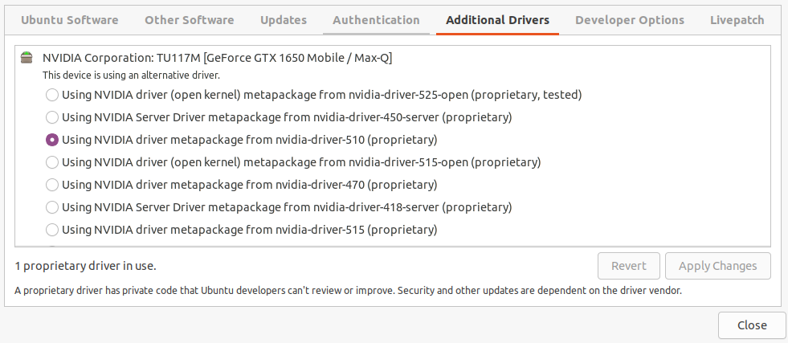

# A Walk in the Park

Code to replicate [A Walk in the Park: Learning to Walk in 20 Minutes With Model-Free Reinforcement Learning](https://arxiv.org/abs/2208.07860), which contains code for training a simulated or real A1 quadrupedal robot to walk. Project page: https://sites.google.com/berkeley.edu/walk-in-the-park

## Installation step [Josselin]
Install [MujoCo](https://github.com/openai/mujoco-py#install-mujoco).
The version `mjpro150` is required, you can find it [here](https://www.roboti.us/download.html). Place it at this path: `~/mujoco/mjpro150`.

Then download a key for Mujoco [here](https://www.roboti.us/license.html) and place it in `~/.mujoco/mjkey.txt`.

Add the following line to `~/.bashrc`:
```bash
export LD_LIBRARY_PATH=$LD_LIBRARY_PATH:/home/josselin/.mujoco/mjpro150/bin
```
An then refresh your terminal with:
```bash
source ~./bashrc
```

Create venv with:
```bash
python -m venv
```

Activate venv with:
```bash
source venv/bin/activate
```

Download a few libraries: (as described [here](https://github.com/openai/mujoco-py/))
```bash
sudo apt install libosmesa6-dev libgl1-mesa-glx libglfw3
```

Install `patchelf` to solve this [issue](https://github.com/openai/mujoco-py/issues/652):
```bash
sudo apt-get install patchelf
```

Install dependencies:
```bash
pip install -r requirements.txt
```

Create a [wandb](https://wandb.ai) account, join the [single-shot-robot](https://wandb.ai/single-shot-robot) project or create your own and copy your API key somewhere you can access later.


### Install Nvidia Driver, CUDA, cuDNN

This is by far the hardest steps. I will share what worked for me (Ubuntu 20.04, GeForce GTX 1650 Mobile). You can check your GPU setup with:
```bash
lspci | grep VGA
```
This is what I get:
```bash
00:02.0 VGA compatible controller: Intel Corporation UHD Graphics 630 (Mobile)
01:00.0 VGA compatible controller: NVIDIA Corporation TU117M [GeForce GTX 1650 Mobile / Max-Q] (rev a1)
```

**I am gonna explain the steps I personally took, they might be different for you.** We are going to install Nvidia's Driver 510.108.03, CUDA 11.6 and cuDNN 8.6.0

#### Driver installation
There are several ways to install the driver. What worked for me was to use the GUI to find the app "Additional Drivers", and in Nvidia Corporation choose the driver version (don't select "-open" version).

If this does not show up you can install manually (I also tried it this way). See the link in the next section.

#### CUDA and cuDNN installation
I mostly followed these [instructions](https://github.com/ashutoshIITK/install_cuda_cudnn_ubuntu_20). Keep in mind that this is old, to run this repo you need cuDNN >= 8.6.0 so I recommend installing CUDA 11.6 and cuDNN 8.6.0. If you did not install the driver with the GUI interface you can also follow the instructions. To install the driver I had to **disable Nouveau** which caused my screen to become black, see the next section to fix this.

When installing CUDA, make sure to put the appropriate CUDA version in your path:
```bash
echo 'export PATH=/usr/local/cuda-11.6/bin:$PATH' >> ~/.bashrc
echo 'export LD_LIBRARY_PATH=/usr/local/cuda-11.6/lib64:$LD_LIBRARY_PATH' >> ~/.bashrc
source ~/.bashrc
sudo ldconfig
```
(In the link they use CUDA 11.4).

Also for cuDNN, the paths change a bit:
After downloading, run:
```bash
tar xf ${CUDNN_TAR_FILE}
```
to unzip the file and rename it `cuda`.
Then run:
```bash
sudo cp -P cuda/include/cudnn.h /usr/local/cuda/include
sudo cp -P cuda/lib/libcudnn* /usr/local/cuda/lib64/
sudo chmod a+r /usr/local/cuda/lib64/libcudnn*
```
Make sure to run these commands and not the old ones described in the post using a version specific path `/usr/local/cuda-11.4` (I tried and it did not work for me).

At this point you can safely delete the folder that you unzipped and renamed `cuda`.

#### Problem: Black screen after Driver install
If you get a black screen after installation (which happened to me), you might follow **generix**'s instruction [here](https://forums.developer.nvidia.com/t/black-screen-after-install-of-nvidia-driver-ubuntu/109312). The steps are:
- delete /etc/X11/xorg.conf
- make sure nvidia-prime is installed (sudo apt install --reinstall nvidia-prime)
- switch to nvidia (sudo prime-select nvidia)
- remove stray blacklist files (sudo rm /lib/modprobe.d/blacklist-nvidia.conf /etc/modprobe.dblacklist-nvidia.conf)
- update the initrd (sudo update-initramfs -u)
- reboot

#### Check installation

**To check that the driver has been properly installed, you can run:**
```bash
nvidia-smi
```
This is what I get:
```bash
Fri Apr 14 15:26:35 2023       
+-----------------------------------------------------------------------------+
| NVIDIA-SMI 510.108.03   Driver Version: 510.108.03   CUDA Version: 11.6     |
|-------------------------------+----------------------+----------------------+
| GPU  Name        Persistence-M| Bus-Id        Disp.A | Volatile Uncorr. ECC |
| Fan  Temp  Perf  Pwr:Usage/Cap|         Memory-Usage | GPU-Util  Compute M. |
|                               |                      |               MIG M. |
|===============================+======================+======================|
|   0  NVIDIA GeForce ...  Off  | 00000000:01:00.0 Off |                  N/A |
| N/A   48C    P8     3W /  N/A |    606MiB /  4096MiB |      1%      Default |
|                               |                      |                  N/A |
+-------------------------------+----------------------+----------------------+
                                                                               
+-----------------------------------------------------------------------------+
| Processes:                                                                  |
|  GPU   GI   CI        PID   Type   Process name                  GPU Memory |
|        ID   ID                                                   Usage      |
|=============================================================================|
|    0   N/A  N/A      1248      G   /usr/lib/xorg/Xorg                208MiB |
|    0   N/A  N/A      1603      G   /usr/bin/gnome-shell               75MiB |
|    0   N/A  N/A      2654      G   ...290826249583000452,131072      104MiB |
|    0   N/A  N/A      8996      G   ...veSuggestionsOnlyOnDemand       56MiB |
|    0   N/A  N/A      9650      G   ...RendererForSitePerProcess      156MiB |
+-----------------------------------------------------------------------------+
```

**To check that CUDA has been installed, you can run:**
```bash
nvcc --version
```
This is what I get:
```bash
nvcc: NVIDIA (R) Cuda compiler driver
Copyright (c) 2005-2022 NVIDIA Corporation
Built on Tue_Mar__8_18:18:20_PST_2022
Cuda compilation tools, release 11.6, V11.6.124
Build cuda_11.6.r11.6/compiler.31057947_0
```
**Finally, to check that cuDNN has been installed, you can run:**
```bash
cat /usr/local/cuda/include/cudnn_version.h | grep CUDNN_MAJOR -A 2
```
This is what I get:
```bash
#define CUDNN_MAJOR 8
#define CUDNN_MINOR 6
#define CUDNN_PATCHLEVEL 0
--
#define CUDNN_VERSION (CUDNN_MAJOR * 1000 + CUDNN_MINOR * 100 + CUDNN_PATCHLEVEL)

/* cannot use constexpr here since this is a C-only file */
```
You should have cuDNN >= 8.6.0 installed (but same Major version, here 8).

### Run the simulation
```bash
XLA_FLAGS=--xla_gpu_cuda_data_dir=/usr/lib/cuda MUJOCO_GL=egl XLA_PYTHON_CLIENT_PREALLOCATE=false python train_online.py --env_name=A1Run-v0 \
                --utd_ratio=20 \
                --start_training=1000 \
                --max_steps=100000 \
                --config=configs/droq_config.py
```

When asked how to run `wandb` type: `2` for `Use an existing W&B account` and then enter your API key.

***I have not tried to build the SDK, I only work with the simulation for now.***

## Installation (Provided by the original repo)

Install dependencies:
```bash
pip install -r requirements.txt
```

To install the robot [SDK](https://github.com/unitreerobotics/unitree_legged_sdk), first install the dependencies in the README.md

To build, run: 
```bash
cd real/third_party/unitree_legged_sdk
mkdir build
cd build
cmake ..
make
``` 

Finally, copy the built `robot_interface.XXX.so` file to this directory.

## Training

Example command to run simulated training:

```bash
MUJOCO_GL=egl XLA_PYTHON_CLIENT_PREALLOCATE=false python train_online.py --env_name=A1Run-v0 \
                --utd_ratio=20 \
                --start_training=1000 \
                --max_steps=100000 \
                --config=configs/droq_config.py
```

To run training on the real robot, add `--real_robot=True`

